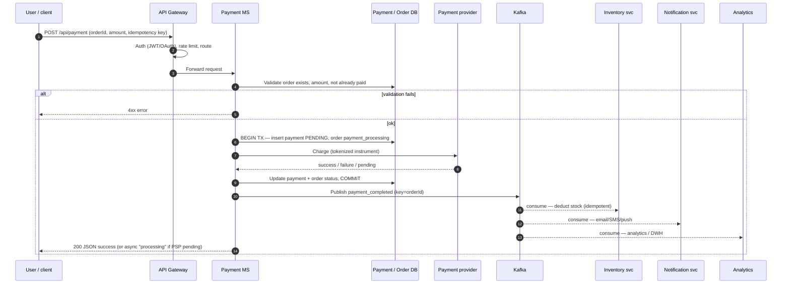

# Payment Flows, Microservices/Jobs/Cron & Master Architecture + 50+ Q&A

> **Source:** Extracted from `notes/All_chats.md` (Akamai SDE-II prep). Content preserved; reorganized into Concepts vs Interview sections.

**How this file is laid out:** **Concepts** (definitions, ASCII + Mermaid, payment walkthrough) → **Interview** (**question bank** in tables, then **Answers** with `#### Qn` + **Answer** blocks). **ASCII** diagrams live in fenced *text* code blocks — use a wide editor or horizontal scroll. **Mermaid** diagrams render on GitHub and in many Markdown previews.

## Concepts

> *Skim **At a glance** first — a short on-ramp. Below the line is the full chapter.*

---

### At a glance · how to use this file

- **Opening (60–90s):** Happy path in order: gateway → payment service → **DB + PSP** → commit → **domain event** → async consumers (inventory, notifications). Then name **two** risks: **double payment** and **duplicate / out-of-order events**.
- **Go deeper only where prompted:** Kafka (partitions, consumer groups, idempotent consumers), **transactions** (isolation, locks), **resilience** (timeouts, sagas, DLQ), or **observability** (traces, SLOs).
- The **50+ Q&A** section is for **spoken** practice; paraphrase in your own words.

#### Talk track (~1 min)

1. **Ingress:** `POST /payments` through **API Gateway** — JWT/OAuth, rate limits, routing to Payment service.  
2. **Validate:** Order exists, amount matches, idempotency key (header/body) checked to prevent double submit.  
3. **Persist + PSP:** Start **DB transaction** — payment row `PENDING`; call **payment processor** with **token** (no raw PAN).  
4. **Commit + emit:** On PSP success — commit payment + order state; **publish** `payment_completed` (Kafka key = `orderId` for ordering).  
5. **Async side effects:** Consumers update inventory, send email/push, warehouse/analytics — **idempotent** on `paymentId`/`eventId`; failures → **retry** then **DLQ**.  
6. **Ops:** Cache hot status, **metrics + distributed trace** (`trace_id` from gateway), alerts on error rate and **consumer lag**.

---

### Microservice vs API vs job vs cron job

The subsections below define each term, then a **comparison table**, an **ASCII diagram** (monospace / wide terminal), and a short legend.

#### 1. Microservices

| | |
|--|--|
| **Definition** | A **microservice** is a self-contained, independently deployable unit that implements one business capability. Services talk over **APIs**, **queues**, or **messaging**. |
| **Why it matters** | Each service can **own its data**, **scale**, and **fail** independently. |

**Examples**

- E-commerce: Catalog, Order, Payment, Recommendations.
- Streaming: Upload, Transcode, Recommendations.

**Typical split**

- **Catalog MS** — product CRUD and search-facing data.
- **Order MS** — cart/checkout and order lifecycle.
- **Payment MS** — charges, PSP integration, payment state.

#### 2. API (application programming interface)

| | |
|--|--|
| **Definition** | A **contract** between systems: REST, GraphQL, gRPC, etc. |
| **Relation to MS** | **Microservice** = implementation; **API** = the **surface** clients and other services call. |

**Examples**

```http
GET /products          → list or search products
POST /checkout         → place an order
```

**Analogy:** microservice = kitchen; API = menu + ordering counter.

#### 3. Job (unit of work)

| | |
|--|--|
| **Definition** | A **job** is a unit of work: one-shot, event-triggered, or scheduled. Often **async** or **batch**. |
| **Examples** | Daily sales report; fan-out emails; video transcoding after upload. |

**Pseudo-code**

```python
def send_daily_email_report():
    users = get_all_users()
    for user in users:
        send_email(user)
```

#### 4. Cron job (scheduled job)

| | |
|--|--|
| **Definition** | A **cron job** is a job triggered by a **time schedule** (Unix `cron` or managed scheduler). |
| **Examples** | Nightly backup; every-15-min temp cleanup; weekly newsletter. |

**Example expressions**

```cron
0 0 * * *       /backup/db.sh              # daily at midnight
*/15 * * * *    /scripts/clean_temp_files.sh
0 2 * * 1       python send_weekly_newsletter.py   # Mondays 02:00
```

#### Comparison

| Concept | Runs on | Role | Typical trigger |
|--------|---------|------|------------------|
| **Microservice** | Containers / VMs | Business logic + data | API call, events |
| **API** | Inside a service | Contract / access surface | HTTP, gRPC |
| **Job** | Workers / queue | Async or batch work | Event, API, schedule |
| **Cron job** | OS / scheduler | **Scheduled** variant of a job | Cron expression |

#### Real-world slice (e-commerce)

| Layer | Example |
|-------|---------|
| **Microservice** | Order service validates inventory and creates orders. |
| **API** | `POST /orders` exposes that behavior to web and mobile. |
| **Job** | `daily_sales_job` aggregates orders for reporting. |
| **Cron** | Schedule `daily_sales_job` at **00:00** every day. |

#### ASCII diagram — microservices → APIs → jobs → cron

Use a **wide editor** or horizontal scroll; this is the same structure as before, just fenced so it stays monospace.

```text
                            ┌──────────────────────┐
                            │      Client / UI      │
                            └─────────┬────────────┘
                                      │
                                      ▼
                            ┌──────────────────────┐
                            │        API Layer      │
                            │  (REST / GraphQL)     │
                            └─────────┬────────────┘
                                      │
                  ┌───────────────────┼───────────────────┐
                  ▼                   ▼                   ▼
       ┌────────────────┐   ┌────────────────┐   ┌────────────────┐
       │ Catalog MS     │   │ Order MS       │   │ Payment MS     │
       │ (Products)     │   │ (Orders)       │   │ (Payments)     │
       └────────────────┘   └────────────────┘   └────────────────┘
                  │                   │                   │
                  ▼                   ▼                   ▼
          ┌─────────────┐     ┌─────────────┐     ┌─────────────┐
          │ DB / Cache  │     │ DB / Cache  │     │ DB / Cache  │
          └─────────────┘     └─────────────┘     └─────────────┘
                  │                   │                   │
                  ▼                   ▼                   ▼
           ┌───────────┐      ┌───────────┐       ┌───────────┐
           │ Background│      │ Background│       │ Background│
           │ Job Queue │      │ Job Queue │       │ Job Queue │
           └─────┬─────┘      └─────┬─────┘       └─────┬─────┘
                 │                  │                  │
      ┌──────────┴──────────┐       │                  │
      ▼                     ▼       ▼                  ▼
┌───────────────┐   ┌───────────────┐     ┌──────────────────┐
│ Send Emails   │   │ Update Search │     │ Inventory Update  │
│ (Async Job)   │   │ Indexing Job  │     │ (Async Job)       │
└───────────────┘   └───────────────┘     └──────────────────┘
      ▲                     ▲                  ▲
      │                     │                  │
┌───────────────┐   ┌───────────────┐    ┌──────────────────┐
│ Cron Job      │   │ Cron Job      │    │ Cron Job          │
│ Daily Report  │   │ Rebuild Index │    │ Reset Daily Sales │
└───────────────┘   └───────────────┘    └──────────────────┘
```

##### Legend (same flow in words)

- **Client / UI** — `POST /orders`, `GET /products`, etc.
- **API layer** — routes to the right microservice; auth and rate limits often live on a **gateway** here.
- **Microservices** — Catalog, Order, Payment (each with DB/cache).
- **Background queues** — email, search index, inventory updates off the hot request path.
- **Cron** — pushes work into those queues on a schedule (reports, reindex, daily resets).

##### Interview one-liners

- **Microservice** = **independently deployable** business capability (often with its own DB).
- **API** = **how** others call that capability.
- **Job** = **unit of work** (async / batch / long-running).
- **Cron job** = job with a **clock** trigger.

> **If asked:** “What if a cron job fails?” → Retries with backoff, **dead-letter** path, **alerts**, and **idempotent** job design so a safe re-run does not double-charge or double-send.

> **Original prompt (from chat export):** Walk through what happens from “Pay” through persistence, PSP, Kafka, notifications, and ops — step by step.

Below is the same material, **reformatted**: numbered steps, **JSON in code fences**, and a **Mermaid** sequence you can paste into [Mermaid Live](https://mermaid.live).

### E-commerce payment flow — detailed walkthrough

**Scenario:** user clicks **Pay** on an order.



#### Step 1 — Client → API gateway

Client sends something like:

```http
POST /api/payment
Content-Type: application/json
```

```json
{
  "orderId": "12345",
  "userId": "U1001",
  "paymentMethod": "CreditCard",
  "amount": 499.99
}
```

**Gateway:** authenticates (JWT/OAuth), rate-limits, routes to **Payment MS**.

#### Step 2 — Payment MS validates the order

- Order exists and is not already paid (Orders DB).
- Amount matches order total.
- Optional: inventory still available (or reservation valid).

If validation fails → return a **4xx** to the client.

#### Step 3 — DB transaction (ACID)

In **Postgres** (or similar), open a transaction:

- Insert **Payments** row: `paymentId`, `orderId`, `userId`, `amount`, `status = pending`.
- Update **Orders**: e.g. `payment_processing`.

Use an isolation level appropriate to your policy (**REPEATABLE READ** / **SERIALIZABLE** or explicit row locks) to reduce **double-pay** races.

#### Step 4 — Call the PSP (Stripe, Razorpay, PayPal, …)

Never send raw PAN; use **tokens** from the provider.

```json
{
  "amount": 499.99,
  "currency": "USD",
  "cardInfo": "tokenized",
  "orderId": "12345"
}
```

Response: **success**, **failure**, or **pending** (async PSP).

#### Step 5 — Persist PSP outcome

In the same transaction or a carefully ordered follow-up:

- **Success** → `Payments.status = completed`, `Orders.status = paid` (or equivalent).
- **Failure** → `Payments.status = failed`; release inventory reservation if your design uses one.

#### Step 6 — Publish `payment_completed` to Kafka

```json
{
  "orderId": "12345",
  "paymentId": "P56789",
  "userId": "U1001",
  "amount": 499.99,
  "status": "completed",
  "timestamp": "2026-03-21T12:00:00Z"
}
```

Partition by **`orderId`** (or `paymentId` policy you document) so **ordering** holds per order.

#### Step 7 — Consumers (async side effects)

| Consumer | Action |
|----------|--------|
| **Inventory** | Deduct stock; idempotent on `paymentId` / `eventId`. |
| **Notification** | Email / SMS / push. |
| **Order / analytics** | Audit trail, dashboards, DWH. |

Retries + **DLQ** for poison messages; consumers must be **idempotent** (at-least-once delivery).

#### Step 8 — Background jobs / cron

Examples: invoice PDF, loyalty points, finance extracts to **Snowflake / Redshift**.

#### Step 9 — Cache & monitoring

- **Redis:** hot reads — recent orders, payment status for `GET` polling.
- **Metrics:** latency, errors, PSP timeouts, **consumer lag**, DB slow queries.
- **Logs/traces:** correlation id from gateway across MS + Kafka handlers.

#### Step 10 — HTTP response to client

```json
{
  "status": "success",
  "orderId": "12345",
  "paymentId": "P56789",
  "message": "Payment successful!"
}
```

#### Step 11 — Observability & alerts

| Signal | Tooling (examples) |
|--------|-------------------|
| API logs | ELK, CloudWatch, Datadog |
| Kafka lag | Burrow, broker metrics, Grafana |
| DB | slow query log, lock waits |
| Alerts | error rate, lag SLO, PSP failure spike |

##### Linear flow (text)

```text
User → Client → API Gateway → Payment MS → DB → PSP
Payment MS → Kafka → Inventory / Notification / Analytics
Notification → Email/SMS → User
Jobs → Invoice / loyalty / reports
Observability → metrics + traces + logs → alerts
```

##### SDE-2 talking points (quick list)

- **Transactional safety:** DB boundaries + isolation vs **double payment**.
- **Async decoupling:** Kafka for fan-out without blocking the HTTP path.
- **Retries & DLQ:** don’t lose work; surface poison pills.
- **Idempotency:** API keys + consumer dedupe.
- **Caching:** Redis for read-heavy status.
- **Scale:** partitions × consumer groups; stateless app tier.

> **One-line chain:** `Client → API → Payment MS → DB → PSP → Kafka → Inventory / Notification → jobs → metrics/traces`.

### Payment transaction — ASCII map (standard)

```text
                           ┌───────────────┐
                           │     User      │
                           │ Web / Mobile  │
                           └───────┬───────┘
                                   │
                                   ▼
                           ┌───────────────┐
                           │  API Gateway  │
                           │ Auth / Rate   │
                           │ Limiting      │
                           └───────┬───────┘
                                   │
                        ┌──────────┴───────────┐
                        ▼                      ▼
                 ┌─────────────┐        ┌─────────────┐
                 │ Payment MS  │        │ Order MS    │
                 │ Validate    │        │ Update      │
                 │ Payment     │        │ Order Status│
                 └───────┬─────┘        └───────┬─────┘
                         │                     │
         ┌───────────────┼───────────────┐     │
         ▼               ▼               ▼     ▼
 ┌─────────────┐ ┌─────────────┐ ┌─────────────┐
 │ Payment DB  │ │ Kafka Topic │ │ Inventory MS │
 │ Payments    │ │ "payment_completed" │ │ Deduct Stock │
 │ Orders      │ └───────┬─────┘ └───────┬─────┘
 └───────┬─────┘         │             │
         ▼               ▼             ▼
 ┌─────────────┐ ┌─────────────┐ ┌─────────────┐
 │ Consumer    │ │ Notification │ │ Analytics / │
 │ (Inventory) │ │ Service     │ │ Reporting   │
 │ Updates DB  │ │ Email/SMS   │ │ DB / Snowflake │
 └───────┬─────┘ └───────┬─────┘ └─────────────┘
         │                │
         ▼                ▼
 ┌─────────────┐ ┌─────────────┐
 │ Retry Topic │ │ DLQ Topic   │
 │ "payment_retry" │ │ "payment_dlq" │
 └───────┬─────┘ └─────────────┘
         │
         ▼
 ┌─────────────┐
 │ Background  │
 │ Jobs / Cron │
 │ Invoice /   │
 │ Loyalty     │
 └───────┬─────┘
         ▼
 ┌─────────────┐
 │ Redis Cache │
 │ Recent Orders│
 │ Payment Status│
 └───────┬─────┘
         ▼
 ┌─────────────┐
 │ Monitoring  │
 │ Prometheus  │
 │ Grafana /   │
 │ ELK / Alerts│
 └─────────────┘
```

### Flow explanation (step-by-step) — matches the ASCII map above

| Step | What happens |
|------|----------------|
| **User → API gateway** | `POST` payment; JWT/OAuth; rate limit; route to Payment MS. |
| **Payment MS → validation** | Order exists; amount OK; begin DB tx (Payments + Orders). |
| **Payment MS → PSP** | Charge tokenized instrument; success / fail / pending. |
| **Payment MS → DB** | Commit status (completed / failed). |
| **Payment MS → Kafka** | `payment_completed`; partition key = `orderId`. |
| **Kafka → consumers** | Inventory (stock), Notification (email/SMS), Analytics (DWH). |
| **Retries / DLQ** | Transient → retry topic; poison → DLQ + human triage. |
| **Jobs / cron** | Invoice PDF, loyalty, scheduled finance extracts. |
| **Redis** | Hot reads: order/payment status for polling clients. |
| **Monitoring** | Latency, errors, consumer lag, DB health; alert on SLO breach. |
| **Response** | Final JSON to client; user sees confirmation (or “processing” if PSP async). |

#### SDE-2 interview bullets (this diagram)

- **Transaction safety:** ACID on the payment path; no double-settle without idempotency.
- **Async decoupling:** Kafka fans out without blocking HTTP.
- **Retry & DLQ:** no silent loss; poison messages surfaced.
- **Idempotency:** consumers tolerate duplicate delivery.
- **Observability + cache:** same as the detailed walkthrough above.


### Enterprise-grade payment flow — ASCII map

```text
                            ┌───────────────┐
                            │     User      │
                            │ Web / Mobile  │
                            └───────┬───────┘
                                    │
                                    ▼
                            ┌───────────────┐
                            │  API Gateway  │
                            │ Auth / Rate   │
                            │ Limiting      │
                            └───────┬───────┘
                                    │
                      ┌─────────────┴─────────────┐
                      ▼                           ▼
               ┌─────────────┐             ┌─────────────┐
               │ Payment MS  │             │ Order MS    │
               │ Validate &  │             │ Update      │
               │ Initiate TX │             │ Order Status│
               └───────┬─────┘             └───────┬─────┘
                       │                           │
             ┌─────────┼───────────┐               │
             ▼         ▼           ▼               ▼
      ┌─────────────┐ ┌─────────────┐ ┌─────────────┐
      │ Payment DB  │ │ Kafka Topic │ │ Inventory MS │
      │ ACID TX     │ │ "payment_completed" │ │ Deduct Stock │
      └───────┬─────┘ └───────┬─────┘ └───────┬─────┘
              │                 │              │
        ┌─────┴─────┐    ┌──────┴──────┐      ▼
        ▼           ▼    ▼             ▼ ┌─────────────┐
   Multi-Region   Replication / Partitioning │ Redis Cache │
   DB Clusters    │ Exactly-Once Semantics │ Hot Order Status │
                  │ & Consumer Groups     └─────────────┘
                  ▼
         ┌─────────────────────────┐
         │ Kafka Consumers          │
         │ Inventory / Notification │
         │ Analytics / Reporting    │
         └───────┬─────────────────┘
                 ▼
           ┌─────────────┐
           │ Retry Topic │
           │ "payment_retry" │
           └───────┬─────┘
                   ▼
           ┌─────────────┐
           │ DLQ Topic   │
           │ "payment_dlq" │
           └───────┬─────┘
                   ▼
            ┌─────────────┐
            │ Background  │
            │ Jobs / Cron │
            │ Invoice /   │
            │ Loyalty     │
            └───────┬─────┘
                   ▼
            ┌─────────────┐
            │ Monitoring  │
            │ Prometheus  │
            │ Grafana /   │
            │ ELK / Alerts│
            └─────────────┘
```

### Enterprise-level enhancements

| Theme | What to say |
|-------|-------------|
| **Multi-region DB & Kafka** | Replicated DB and brokers for **DR** and failover. |
| **Delivery semantics** | “Exactly-once” in practice → **idempotent** producers/consumers + dedupe; know the tradeoffs. |
| **Retry & DLQ** | Transient → retry with backoff; permanent → **DLQ** + runbook. |
| **Caching** | Redis for hot **order/payment** reads; watch invalidation. |
| **Async boundaries** | Inventory, notification, analytics **off** the synchronous pay path. |
| **Jobs / cron** | Invoice, loyalty, finance extracts — **scheduled** off critical path. |
| **Observability** | Metrics (lag, latency), logs, traces, **alerts** on SLOs. |
| **Fault tolerance** | Kafka replication; DB HA — **no single broker** story. |

#### Enterprise flow (same as standard path, louder ops)

1. Pay → gateway → Payment MS → **ACID** local transaction → PSP.  
2. Commit → **Kafka** `payment_completed` (keyed for order).  
3. **Multi-region** consumers: inventory, notification, analytics.  
4. Failures → **retry** → **DLQ**; jobs fill out invoice/loyalty/reporting.  
5. **Redis** for hot reads; **dashboards** for lag and errors.

#### SDE-2 / Akamai angles

- End-to-end **event-driven** story + where **strong consistency** actually lives.  
- **Idempotency** at API and consumer.  
- **Horizontal scale:** partitions × consumer groups; **multi-region** DR.  
- **Production hygiene:** metrics, logs, traces, **on-call** alerts.

### Master system design map — ASCII

```text
                               ┌───────────────┐
                               │     User      │
                               │ Web / Mobile  │
                               └───────┬───────┘
                                       │
                                       ▼
                               ┌───────────────┐
                               │  API Gateway  │
                               │ Auth (OAuth)  │
                               │ Rate Limiting │
                               └───────┬───────┘
                                       │
                  ┌────────────────────┼────────────────────┐
                  ▼                    ▼                    ▼
           ┌─────────────┐      ┌─────────────┐      ┌─────────────┐
           │ Payment MS  │      │ Order MS    │      │ Job MS      │
           │ Transaction │      │ Manage      │      │ Alerts /    │
           │ Kafka Prod  │      │ Kafka Prod  │      │ Scheduler   │
           └───────┬─────┘      └───────┬─────┘      └───────┬─────┘
                   │                    │                    │
         ┌─────────┼───────────┐        │                    │
         ▼         ▼           ▼        ▼                    ▼
 ┌─────────────┐ ┌─────────────┐ ┌─────────────┐    ┌─────────────┐
 │ Payment DB  │ │ Kafka Topic │ │ Inventory MS │    │ Job DB      │
 │ ACID TX     │ │ "payment_completed" │ Deduct Stock │           │
 └───────┬─────┘ └───────┬─────┘ └───────┬─────┘    └───────┬─────┘
         │                 │              │                  │
         ▼                 ▼              ▼                  ▼
 ┌─────────────┐   ┌─────────────┐ ┌─────────────┐    ┌─────────────┐
 │ Multi-Region│   │ Consumer    │ │ Notification │    │ Cron Jobs   │
 │ DB Cluster  │   │ Group      │ │ Email/SMS/Push│   │ Reports     │
 └───────┬─────┘   └───────┬─────┘ └───────┬─────┘    └───────┬─────┘
         │                 │              │                  │
         ▼                 ▼              ▼                  ▼
 ┌─────────────┐   ┌─────────────┐ ┌─────────────┐    ┌─────────────┐
 │ Redis Cache │   │ Retry Topic │ │ DLQ Topic   │    │ Analytics / │
 │ Hot Orders  │   │ "retry"     │ │ "dlq"      │    │ Data Lake   │
 └───────┬─────┘   └───────┬─────┘ └───────┬─────┘    └───────┬─────┘
         │                 │              │                  │
         ▼                 ▼              ▼                  ▼
 ┌─────────────┐   ┌─────────────┐ ┌─────────────┐    ┌─────────────┐
 │ Monitoring  │   │ Kafka Logs   │ │ CI/CD Pipelines │ │ Cloud      │
 │ Prometheus  │   │ Elastic /    │ │ Jenkins / Argo │ │ AWS/GCP    │
 │ Grafana / ELK│ │ Splunk      │ │ Docker / K8s   │ │ Multi-Region│
 └─────────────┘   └─────────────┘ └─────────────┘    └─────────────┘
```

### Explanation of components (master map)

| Area | Role in the diagram |
|------|---------------------|
| **Users & API gateway** | Single entry: **OAuth**, **rate limits**, routing to services. |
| **Microservices** | **Payment** (PSP + Kafka out), **Order** (lifecycle), **Inventory** (stock), **Job/scheduler** (cron-driven work). |
| **Data stores** | **Regional** OLTP for payments; **Redis** hot reads; **warehouse** for analytics. |
| **Kafka** | Topics like `payment_completed`, consumer groups, **retry/DLQ** sidecars. |
| **Ops** | **Metrics/logs**, **CI/CD**, **multi-region** cloud footprint. |

#### Interview checklist (map-sized)

- **Event-driven** fan-out vs **sync** PSP call.  
- **ACID** where money moves; **idempotent** consumers.  
- **Retries / DLQ**; **caching**; **deploy** story (K8s, envs).  
- **DR**: multi-region **Kafka + DB**.

> **This map is a single canvas** tying payment flow, notifications, analytics, jobs, inventory, data stores, Kafka, cache, observability, pipelines, and cloud — useful for **end-to-end** SDE-2 answers.

**Topic coverage:** Kafka · microservices · DB transactions & isolation · CI/CD & DevOps · security/auth · system design (all anchored to the diagram above).

#### Patterns & edge cases

| Topic | What to say in one breath |
|-------|---------------------------|
| **Saga vs 2PC** | 2PC is rare across services (latency, blocking). Prefer **saga**: local commits + **compensating** steps (e.g. refund) or **orchestration** vs **choreography** for multi-step flows. |
| **Transactional outbox** | Don’t “commit DB then hope Kafka send works.” Write event in **same transaction** as state change (outbox table); **relay/publisher** drains to broker — avoids lost events. |
| **PSP webhooks** | Many flows are **async**: user sees “processing” until PSP **callback/webhook** arrives. Verify **signature**, **idempotency** on `event_id`, reconcile with internal payment row. |
| **Exactly-once** | True E2E exactly-once is hard; interview answer = **idempotent** consumers + at-least-once broker + **dedupe store** (`processed_event_id`). |
| **CAP / consistency** | Payment **ledger** strongly consistent in primary path; **read models** (search, analytics) can lag (**eventual**). Say what must never be wrong vs what can be stale. |
| **PCI scope** | Card data in **PSP/token vault**; your DB stores **tokens/ids**. Reduces compliance surface — mention if asked “do we store cards?” |
| **Chargebacks / disputes** | Separate **dispute** state; don’t delete history; **append-only audit**; webhook or batch from PSP. |
| **Clock / ordering** | Use **server timestamps** or PSP time for reconciliation; don’t rely only on client clock. |

#### When things go wrong

- **PSP timeout:** Payment unknown — use **idempotency key** on retry; reconcile via PSP API; possible state **`PROCESSING`** until settled.  
- **DB commit succeeded, publish failed:** **Outbox** or **CDC** to avoid orphan paid orders with no event.  
- **Duplicate Kafka delivery:** Consumer checks **processed ids** or natural keys before side effects.  
- **Inventory oversell:** Reserve stock **before** payment or on `order_created`; define policy if payment fails after reserve (TTL release).  
- **Cron double-fire:** Run jobs with **lease/lock** row or **leader election** so midnight job doesn’t run twice during deploy.

---

## Interview questions, mocks & scenarios

Use the **question bank** below for quick drills (tables = one screen per topic). **Answers** start in the next section — each **`#### Qn`** is the question; **`Answer`** is the talk track.

### Question bank — Topic A · Microservices & API design

| # | Question |
|---|----------|
| 1 | Explain how Payment MS, Order MS, Inventory MS, and Notification MS interact. |
| 2 | How would you ensure idempotency for repeated payment requests? |
| 3 | Explain synchronous vs asynchronous communication in this system. Which services use sync vs async? |
| 4 | How would you scale Payment MS horizontally for high traffic? |
| 5 | How would you design API versioning for backward compatibility? |
| 6 | How do you handle partial failures in multi-service transactions? |
| 7 | Explain the circuit breaker pattern for payment gateway failures. |
| 8 | How would you monitor API latency and failures per service? |
| 9 | How would you design rate limiting per user / service? |
| 10 | How would you handle large payloads (order + payment + metadata)? |

> **Hint (topic A):** Event-driven via Kafka; decoupled async flow.

### Question bank — Topic B · Database & transactions

| # | Question |
|---|----------|
| 11 | Explain ACID in the Payment DB. Why SERIALIZABLE vs REPEATABLE READ? |
| 12 | How would you handle double payment / race conditions? |
| 13 | How would you scale Order DB for read-heavy workloads? |
| 14 | When would you use Redis vs SQL? |
| 15 | Explain multi-region DB replication and failover. |
| 16 | How would you implement eventual consistency across microservices? |
| 17 | How do transaction isolation levels affect performance? |
| 18 | Why Snowflake / Redshift for analytics vs the Payment DB? |
| 19 | How would you implement audit logs for payment transactions? |
| 20 | How would you archive old payment data without hurting queries? |

### Question bank — Topic C · Kafka & event-driven architecture

| # | Question |
|---|----------|
| 21 | Explain Kafka partitioning and ordering guarantees. |
| 22 | How does Kafka achieve high availability? |
| 23 | What are exactly-once, at-least-once, at-most-once semantics? |
| 24 | How would you reprocess failed messages? |
| 25 | How would you design retry topics and DLQs? |
| 26 | How would you monitor Kafka consumer lag and throughput? |
| 27 | How would you scale Kafka consumers horizontally? |
| 28 | How would you handle multi-region Kafka replication? |
| 29 | How do you ensure idempotent processing in consumers? |
| 30 | How would you design topic naming / partitioning across apps? |

### Question bank — Topic D · Authentication & security

| # | Question |
|---|----------|
| 31 | How would you implement OAuth / JWT at the API gateway? |
| 32 | How would SAML SSO work for enterprise users? |
| 33 | How would you secure microservices communication internally? |
| 34 | How would you protect Kafka topics from unauthorized access? |
| 35 | How would you encrypt sensitive data at rest and in transit? |
| 36 | How would you implement RBAC in this system? |
| 37 | How do you prevent replay attacks for payment APIs? |
| 38 | How would you secure Redis? |

### Question bank — Topic E · DevOps, CI/CD & monitoring

| # | Question |
|---|----------|
| 39 | How would you implement CI/CD for multiple microservices? |
| 40 | How would you deploy with zero downtime? |
| 41 | How would you use Docker + Kubernetes here? |
| 42 | How would you implement blue-green or canary deployments? |
| 43 | How would you monitor Kubernetes clusters? |
| 44 | How would you alert on high DB latency or consumer lag? |
| 45 | How would you log errors and metrics for troubleshooting? |
| 46 | How would you roll back a failed deployment safely? |
| 47 | How would you automate scaling based on traffic? |
| 48 | How would you handle CI/CD secrets (gateway keys, DB creds)? |

### Question bank — Topic F · System design & architecture

| # | Question |
|---|----------|
| 49 | How would you design fault-tolerant multi-region architecture? |
| 50 | How would you handle millions of concurrent payment requests? |
| 51 | How would you ensure eventual consistency across microservices? |
| 52 | How would you handle dead-letter events for failed notifications? |
| 53 | How would you integrate monitoring, logging, and alerting in production? |
| 54 | How would you optimize end-to-end latency (User → API → Kafka → consumers)? |
| 55 | How would you design data pipelines for analytics / reporting? |
| 56 | How would you handle traffic spikes (e.g. Black Friday) without losing events? |
| 57 | How would you implement distributed tracing across services? |
| 58 | How would you prevent duplicate payments in distributed systems? |

### Cross-topic hints

- Tie answers to **Kafka**, **DB transactions**, **ACID vs eventual** where relevant.  
- Mention **retries**, **DLQs**, **idempotency**, **multi-region DR**, **metrics/traces/alerts**, and **security** defaults.


## Answers (full mock bank)

> Use **Q** headings for scanning; **Answer** blocks are the talk-track bullets you can say aloud.

### Topic A — Microservices & API design

#### Q1 — How Payment MS, Order MS, Inventory MS, Notification MS interact?

**Answer**

Payment MS publishes events to Kafka (payment_completed) → Inventory MS deducts stock, Notification MS sends email/push, Order MS updates order status asynchronously. Decoupled, async, event-driven.

---

#### Q2 — Idempotency for repeated payment requests?

**Answer**

Use paymentIdempotencyKey per request stored in DB / cache. Check before processing to avoid double payments.

---

#### Q3 — Sync vs async communication?

**Answer**

Sync: Payment → Payment Gateway for authorization

Async: Payment → Kafka → Inventory/Notification/Analytics

---

#### Q4 — Scaling Payment MS?

**Answer**

Horizontal scaling: multiple instances behind load balancer

Stateless microservices → scale easily

DB bottleneck → sharding or read replicas

---

#### Q5 — API versioning?

**Answer**

Use URI versioning (/v1/payments) or header versioning

Maintain backward compatibility

---

#### Q6 — Partial failures in multi-service transactions?

**Answer**

Use sagas pattern → orchestrated rollback compensations

Or async events + retries / DLQ

---

#### Q7 — Circuit breaker pattern?

**Answer**

Wrap calls to payment gateway → prevent cascading failures

After threshold → fallback response, alert Ops

---

#### Q8 — Monitor API latency/failures?

**Answer**

Prometheus metrics: request duration, error rate

Grafana dashboards

---

#### Q9 — Rate limiting per user/service?

**Answer**

API Gateway → token bucket / leaky bucket algorithm

Prevent abuse / DDOS

---

#### Q10 — Large payload handling?

**Answer**

Chunking / streaming

Compress JSON payloads (Gzip)

---

### Topic B — Database & transactions

#### Q11 — ACID transaction in Payment DB?

**Answer**

Begin transaction → insert payment → update order → commit

SERIALIZABLE → avoid double payments, highest isolation

---

#### Q12 — Prevent double payment / race?

**Answer**

- Lock the hot row while deciding:

```sql
-- Example: serialize updates to one order’s payment rows
SELECT * FROM payments WHERE order_id = ? FOR UPDATE;
```

- Pair with **SERIALIZABLE** / **REPEATABLE READ** (as appropriate) or **unique constraints** on idempotency keys.

---

#### Q13 — Scale Order DB for read-heavy workload?

**Answer**

Read replicas for query offloading

Redis cache for hot data

---

#### Q14 — Redis vs SQL DB?

**Answer**

Redis: fast reads, hot data (recent orders, payment status)

SQL DB: persistent, ACID transactions

---

#### Q15 — Multi-region DB replication?

**Answer**

Master-slave or multi-master replication

Failover strategy: auto-switch primary if region fails

---

#### Q16 — Eventual consistency?

**Answer**

Kafka event-driven updates → consumers update local DB asynchronously

Accept small time lag

---

#### Q17 — Isolation levels effect on performance?

**Answer**

Higher isolation → less concurrency, more locks

Lower isolation → higher concurrency, risk of phantom reads

---

#### Q18 — Snowflake/Redshift for analytics?

**Answer**

Optimized for large-scale, read-heavy, reporting queries

Payment DB handles transactions → not reporting queries

---

#### Q19 — Audit logs for payments?

**Answer**

Append-only table or Kafka topic

Include userId, timestamp, status changes

---

#### Q20 — Archive old payment data?

**Answer**

Partition tables by date

Move old partitions to cheaper storage (S3 / cold storage)

---

### Topic C — Kafka & event-driven architecture

#### Q21 — Kafka partitioning ensures ordering?

**Answer**

Messages with same key go to same partition → preserves order

---

#### Q22 — Kafka high availability?

**Answer**

Leader + followers per partition

Replication factor ≥ 2

Automatic failover to follower

---

#### Q23 — Delivery semantics?

**Answer**

At-least-once: possible duplicates

At-most-once: possible loss, no duplicates

Exactly-once: idempotent producer + transactional consumer

---

#### Q24 — Reprocess failed messages?

**Answer**

Replay offsets in consumer

Retry topic / DLQ

---

#### Q25 — Retry topics & DLQs?

**Answer**

Retry topic → exponential backoff

DLQ → manual inspection / alerting

---

#### Q26 — Monitor Kafka lag?

**Answer**

```bash
kafka-consumer-groups.sh --describe --group <your-group>
```

Also expose **JMX** / **Prometheus** metrics (lag, throughput) and alert on **consumer lag** SLOs.

---

#### Q27 — Scale Kafka consumers?

**Answer**

Multiple consumer instances in same group → partitions divided

---

#### Q28 — Multi-region replication?

**Answer**

MirrorMaker / Confluent Replicator

Active-active or active-passive

---

#### Q29 — Idempotent consumer processing?

**Answer**

Use unique event IDs

Store processed IDs in DB / cache

---

#### Q30 — Topic naming / partitioning strategy?

**Answer**

Topic per entity (payment_completed, order_created)

Partition by key (userId/orderId) → preserves ordering, balances load

---

### Topic D — Authentication & security

#### Q31 — OAuth/JWT in API Gateway?

**Answer**

API Gateway verifies JWT token signature, scopes

For microservices → pass token in headers

---

#### Q32 — SAML SSO for enterprise?

**Answer**

User logs in via Identity Provider → receives SAML assertion

Service Provider (API Gateway) validates → issues local session

---

#### Q33 — Secure internal microservice communication?

**Answer**

mTLS (mutual TLS)

Service mesh (Istio / Linkerd)

---

#### Q34 — Kafka topic security?

**Answer**

ACLs (read/write) per consumer/producer

Encryption in transit (SSL)

---

#### Q35 — Encrypt sensitive data?

**Answer**

DB at rest → AES-256

In transit → TLS

---

#### Q36 — Role-Based Access Control (RBAC)?

**Answer**

Assign roles per service/user

Permissions for API endpoints

---

#### Q37 — Prevent replay attacks?

**Answer**

Nonce or unique request ID

Expire tokens quickly

---

#### Q38 — Secure Redis cache?

**Answer**

Password authentication

TLS

Network isolation (VPC / firewall rules)

---

### Topic E — DevOps, CI/CD & monitoring

#### Q39 — CI/CD pipelines?

**Answer**

Jenkins / GitHub Actions / ArgoCD

Build → Test → Docker Image → Deploy

---

#### Q40 — Zero-downtime deployment?

**Answer**

Blue-Green or Canary deployments

---

#### Q41 — Docker + Kubernetes usage?

**Answer**

Containerized microservices

Kubernetes → pods, deployment, scaling, rolling updates

---

#### Q42 — Blue-Green / Canary?

**Answer**

Deploy new version → small traffic → monitor → switch 100%

---

#### Q43 — Monitor K8s clusters?

**Answer**

Prometheus → cluster metrics, pod health

Grafana → dashboards

---

#### Q44 — Alert on DB latency / Kafka lag?

**Answer**

Prometheus alert rules

Email / Slack / PagerDuty

---

#### Q45 — Log errors and metrics?

**Answer**

ELK stack / Splunk

Centralized logging

---

#### Q46 — Rollback failed deployment?

**Answer**

Use previous Docker image version

K8s rollback deployment command

---

#### Q47 — Auto-scaling based on traffic?

**Answer**

HPA (Horizontal Pod Autoscaler)

Scale pods based on CPU/memory or custom metrics

---

#### Q48 — Handle CI/CD secrets?

**Answer**

Vault / AWS Secrets Manager / K8s Secrets

Never store in repo

---

### Topic F — System design & architecture

#### Q49 — Fault-tolerant multi-region architecture?

**Answer**

Multi-region DB clusters

Multi-region Kafka cluster

Load balancers / DNS failover

---

#### Q50 — Millions of concurrent payments?

**Answer**

Horizontal scaling, async processing, Kafka partitions, DB sharding

---

#### Q51 — Eventual consistency?

**Answer**

Kafka events → microservices update asynchronously

Accept small lag

---

#### Q52 — Dead-letter events for failed notifications?

**Answer**

DLQ per topic → monitoring + alerting

Manual or automated reprocessing

---

#### Q53 — Monitoring & logging?

**Answer**

Prometheus / Grafana / ELK / Splunk → end-to-end observability

---

#### Q54 — End-to-end latency optimization?

**Answer**

Reduce DB locks

Use Redis cache

Partition Kafka properly

Async processing

---

#### Q55 — Data pipelines for analytics?

**Answer**

Kafka → Stream Processing → Data Warehouse / Snowflake / BigQuery

---

#### Q56 — Handle traffic spikes?

**Answer**

Autoscaling, Kafka partition balancing, async decoupling

Pre-provision DB read replicas

---

#### Q57 — Distributed tracing?

**Answer**

OpenTelemetry → trace request across microservices

Correlate logs / metrics

---

#### Q58 — Prevent duplicate payments?

**Answer**

DB unique constraints

Idempotency keys

Kafka exactly-once semantics

This answers all 50+ mock questions with interview-ready explanations and references to our Master System Design Map.

---

### Bonus scenarios (follow-up drills)

Answer in **2–3 minutes** each; draw one small diagram if helpful.

1. **“Payment returned 504 to the client but PSP charged the card.”** How do you detect, represent state, and communicate to the user without double-charging on retry?  
2. **“Inventory service is down when `payment_completed` arrives.”** Buffer? Retry policy? Risk of selling stock you don’t have — what’s your policy?  
3. **“We must support partial capture (authorize $100, capture $60).”** How does your state machine and events change vs single-shot capture?  
4. **“Regulator asks for proof of who changed payment state.”** What do you log, where, and how long do you retain it?  
5. **“Migrate from monolith `orders` table to Payment + Order services without downtime.”** Strangler, dual-write, or event backfill — sketch a safe sequence.  
6. **“Black Friday: 10× traffic, Kafka lag grows.”** What scales first (brokers, partitions, consumers, DB)? What degrades gracefully (queue checkout, read-only banners)?

### Final checklist (night before)

- [ ] Walk **one-minute talk track** out loud once.  
- [ ] Explain **outbox** or **webhook reconciliation** without slides.  
- [ ] Name your **idempotency** strategy for API + for consumers.  
- [ ] Pick **one** real incident story (payment-adjacent) for behavioral tie-in.
